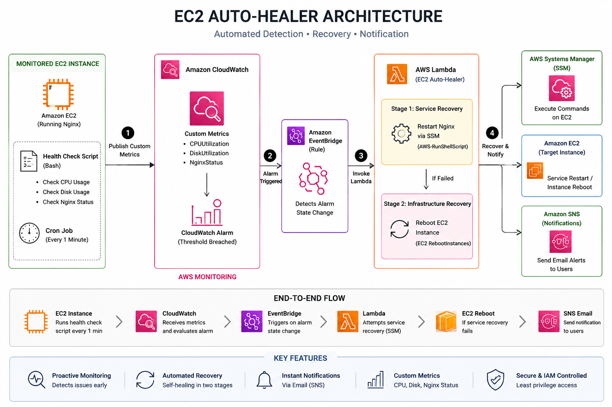

# 🚑 EC2 Auto-Healer

An automated **self-healing infrastructure project on AWS** that detects EC2 application and system health issues, automatically performs recovery actions, and sends incident notifications.

The project combines **Bash, AWS EC2, CloudWatch, EventBridge, Lambda, Systems Manager, and SNS** to demonstrate monitoring, incident response, automation, and infrastructure recovery.

---

## 🏗️ Architecture



### Workflow

```text
EC2 Instance
     │
     ├── Bash Health Check
     ├── Nginx
     └── Cron
          │
          ▼
     CloudWatch
          │
     Health Alarm
          │
          ▼
     EventBridge
          │
          ▼
       Lambda
          │
     ┌────┴─────┐
     ▼          ▼
    SSM        EC2
 Restart      Reboot
 Nginx       Escalation
     │          │
     └────┬─────┘
          ▼
         SNS
          │
          ▼
    Email Notification
```

---

## 🎯 Problem Statement

Production servers can experience application failures, resource exhaustion, or infrastructure problems.

Manual intervention can increase recovery time and potentially cause service downtime.

This project implements an automated recovery workflow that:

* Continuously monitors EC2 health
* Detects application/service failures
* Publishes custom metrics to CloudWatch
* Triggers an alarm when the server becomes unhealthy
* Invokes Lambda through EventBridge
* Attempts service-level recovery
* Escalates to EC2 reboot when required
* Sends SNS email notifications
* Records recovery events in CloudWatch Logs

---

## 🛠️ Technologies Used

| Technology      | Purpose                        |
| --------------- | ------------------------------ |
| AWS EC2         | Compute infrastructure         |
| Ubuntu          | Server operating system        |
| Bash            | Health-check automation        |
| Cron            | Scheduled monitoring           |
| AWS CLI         | AWS API interaction            |
| CloudWatch      | Metrics, alarms and monitoring |
| EventBridge     | Event-driven automation        |
| AWS Lambda      | Serverless incident response   |
| Systems Manager | Remote command execution       |
| SNS             | Email notifications            |
| IAM             | Access control                 |
| Nginx           | Monitored application/service  |

---

## 🔍 Health Checks

The Bash monitoring script checks:

### Nginx

```text
1 = Running
0 = Failed
```

### Disk

```text
< 80% = Healthy
≥ 80% = Warning
```

### CPU

```text
< 90% = Healthy
≥ 90% = Warning
```

### Overall Health

```text
EC2Health = 1
```

when all monitored components are healthy.

```text
EC2Health = 0
```

when one or more components fail.

---

## 📊 CloudWatch Metrics

Custom metrics are published under:

```text
EC2AutoHealer
```

Metrics include:

```text
EC2Health
NginxHealth
CPUHealth
DiskHealth
CPUUsage
DiskUsage
RecoveryAttempt
```

---

## 🔄 Self-Healing Strategy

The project uses a two-stage recovery strategy.

### Stage 1 — Service Recovery

When Nginx fails:

```text
CloudWatch
    ↓
EventBridge
    ↓
Lambda
    ↓
SSM Run Command
    ↓
Restart Nginx
```

If successful, the system avoids rebooting the server.

### Stage 2 — Infrastructure Recovery

If service-level recovery fails:

```text
Lambda
   ↓
EC2 Reboot
   ↓
Instance Recovery
```

This escalation strategy reduces unnecessary infrastructure reboots.

---

## 📧 Alerting

Amazon SNS sends email notifications for:

* Service recovery
* EC2 reboot escalation
* Recovery failures

Example:

```text
EC2 AUTO-HEALER

Instance:
i-xxxxxxxxxxxxxxxxx

Incident:
Nginx service failure detected.

Recovery:
Nginx restart successful.

EC2 reboot:
Not required.
```

---

## 📈 Monitoring Dashboard

The CloudWatch dashboard provides visibility into:

* EC2 overall health
* Nginx health
* CPU health
* Disk health
* CPU utilization
* Disk utilization
* Alarm state
* Recovery attempts

## 🧪 Failure Simulation

The system can be tested by stopping Nginx:

```bash
sudo systemctl stop nginx
```

The monitoring pipeline then detects the failure.

```text
Nginx
  ↓
Health Check
  ↓
EC2Health = 0
  ↓
CloudWatch Alarm
  ↓
EventBridge
  ↓
Lambda
  ↓
SSM
  ↓
Restart Nginx
  ↓
SNS Notification
```

Nginx can be verified with:

```bash
sudo systemctl status nginx
```

and:

```bash
curl http://localhost
```

---

## 📁 Project Structure

```text
ec2-auto-healer/
│
├── architecture/
│   └── architecture.png
│
├── bash/
│   └── health_check.sh
│
├── cloudwatch/
│   └── alarm-config.json
│
├── eventbridge/
│   └── event-pattern.json
│
├── iam/
│   ├── ec2-policy.json
│   └── lambda-policy.json
│
├── lambda/
│   ├── lambda_function.py
│   └── README.md
│
│
├── .gitignore
├── LICENSE
└── README.md
```

---

## 🔐 Security Considerations

This project follows several basic AWS security practices:

* Uses IAM roles instead of hard-coded AWS credentials
* Uses environment variables for Lambda configuration
* Does not store private SSH keys in the repository
* Uses Systems Manager instead of embedding SSH credentials into Lambda
* Uses IAM policies for controlled AWS API access
* Keeps account-specific identifiers out of public configuration files

For production environments, IAM permissions should be further restricted according to the exact resources and actions required.

---

## 🚀 Key Learning Outcomes

Through this project, I practiced:

* Linux server administration
* Bash scripting
* Cron automation
* AWS CLI
* EC2 management
* IAM roles and policies
* CloudWatch custom metrics
* CloudWatch alarms
* Event-driven AWS architecture
* AWS Lambda
* Systems Manager Run Command
* SNS notifications
* Incident detection
* Automated remediation
* Self-healing infrastructure
* Monitoring and observability
* Failure simulation and recovery

---

## 👨‍💻 Author

**Pushkar Narayan**

B.Tech — Computer Science & Information Technology

---

## ⭐ Project Highlights

```text
✓ Automated Monitoring
✓ Event-Driven Architecture
✓ Serverless Automation
✓ Self-Healing Infrastructure
✓ Incident Recovery
✓ AWS CloudWatch
✓ AWS Lambda
✓ AWS Systems Manager
✓ SNS Alerting
✓ Bash Automation
```
